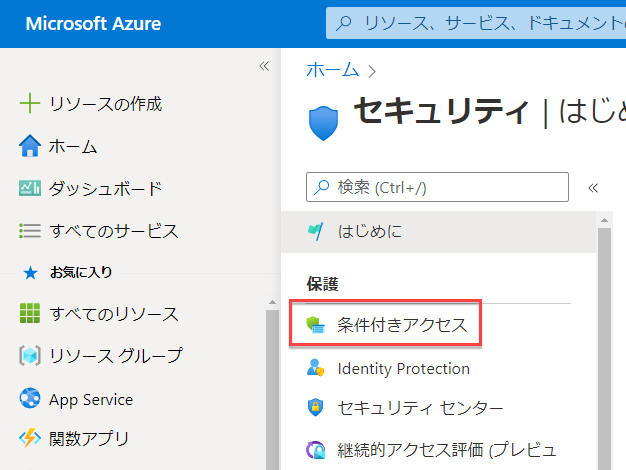
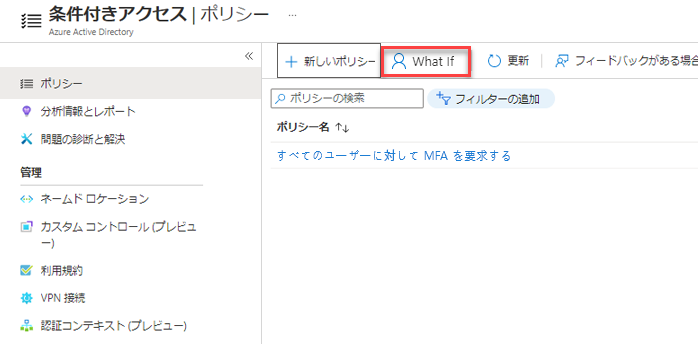
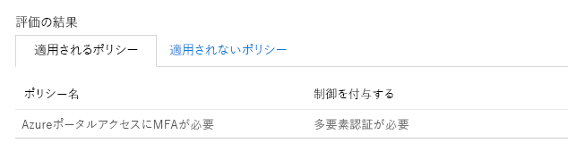

# モジュール 3 - ラボ 1 - 演習 1 -  MFA Authentication Pilot (Azure Active Directory の条件付きアクセスのある特定のアプリでは MFA が必要)

### タスク 1: 条件付きアクセス ポリシーを作成する 

このラボでは、必要な条件付きアクセス ポリシーを作成して特定のユーザーで MFA を要求する方法を示します。シナリオは以下を使用します。

- MFA を必要とするクラウド アプリのプレースホルダーとしての Azure Portal 
- 条件付きアクセス ポリシーをテストするサンプル ユーザー。  

ポリシーに以下の内容を設定します。

|設定 |値|
|---     | --- |
|ユーザーとグループ | Patti Fernandez |
|クラウド アプリ | Microsoft Azure の管理 |
|アクセス権を付与する | 多要素認証を要求する |

 
1.  Azure portal `https://portal.azure.com` に Holly Dickson として、パスワード`Pa55w.rd`を使用してサインインします。

2.  Azure portal のハブ メニューで 「その他のサービス」 を使用して **Azure Active Directory** に移動し、必要に応じて検索できます。

3. 左側で 「**セキュリティ**」 をクリックし、「**条件付きアクセス**」 を選択します。

     
 
5.  「**条件付きアクセス**」 ページの最上部にあるツールバーで 「**新しいポリシー**」 をクリックします。

    **注意**: これがグレー表示されている場合は、ブラウザー セッションを更新します。

6.  「**新規**」 ページの 「**名前**」 テキストボックスに`Require MFA for Azure portal access`と入力します。

7.  「**割り当て**」 セクションで 「**0 件のユーザーとグループが選択されました**」 をクリックします。

8.  「**ユーザーとグループ**」 ページで、次の手順を実行します。

    a. 「**ユーザーとグループを選択**」 をクリックしてから、「**ユーザーとグループ**」 を選択します。
    

    b. 「**選択**」 ページで「Patti Fernandez」を選択してから、「**選ぶ**」 をクリックします。

9.  「新しいページ」 に戻り、「**クラウド アプリまたは操作**」 をクリックします。

10. 「**クラウド アプリまたは操作**」 ページで以下の手順を実行します。

    a. **アプリを選択**をクリックします。

    b. **選択**をクリックします。

    c. **選択**ページで、**Microsoft Azure の管理** を選択してから、**選択**をクリックします。

11.  「**アクセス制御**」 セクションで 「**許可**」 をクリックします。

12.  「**許可**」 ページで以下の手順を実行します。
     1. 「**アクセス権の付与**」 を選択します。
     2.  「**多要素認証が必要**」 を選択します。
     3.  「**選ぶ**」 をクリックします。

13.  「**ポリシーを有効にする**」 セクションで 「**オン**」 をクリックします。

14.  「**作成**」 をクリックします。

**注:** ポリシーが失敗したら、作業内容を確認してから再び 「**作成**」 をクリックします。

### タスク 2: シミュレートされたサインインを評価する

条件付きアクセス ポリシーを構成したら、期待どおりに動作しているかどうかを確認してみましょう。最初の手順として、条件付きアクセスの What If ポリシー ツールを使用して、テスト ユーザーのサインインをシミュレートします。シミュレーションでは、サインインがポリシーに与える影響を推定し、シミュレーション レポートが生成されます。  

What If ポリシー評価ツールを初期化するには、次のように設定します。

- ユーザーは **Patti Fernandez** 
- クラウド アプリは **Microsoft Azure Management**

 「**What If**」 をクリックすると、シミュレート レポートが作成され、次のように表示されます。

- 「**Policies that will apply**」 では 「**Require MFA for Azure portal access**」 
- 「**Grant Controls**」 として 「**多要素認証が必要**」。

1.  条件付きアクセス - ポリシーページの上部のメニューで 「**What If**」 をクリックします。  
 
     

2.  「**ユーザー**」 をクリックして、`Patti Fernandez`を選択してから 「**選択**」 をクリックします。

3.  クラウド アプリを選択するには、次の手順を実行します。

    a. 「**クラウド アプリ、操作、または認証コンテキスト**」 ページで、「**任意のクラウド アプリ**」 を選択します。

    b. 「**アプリを選択**」 をクリックします。

    c. 「**選択**」 ページで、「**Microsoft Azure の管理**」 を選択してから、「**選択**」 をクリックします。

    d. クラウド　アプリまたはアクション　ページで、右上隅にある　「X」　を選択してウィンドウを閉じます。

4.  「What If」 ページで 「**What If**」 を選択します。

5.  結果に注意してください。Azure portal へのアクセスには MFA が必要です。

     

### タスク 3: 条件付きアクセス ポリシーをテストする

前のセクションでは、シミュレートされたサインインを評価する方法を学習しました。シミュレーションに加えて、条件付きアクセスポリシーもテストして、期待どおりに機能することを確認する必要があります。 

ポリシーをテストするには、プライベート参照セッションを開き、**Patti Fernandez** アカウントを使用して Azur portal **`https://portal.azure.com`** にサインインしてみます。追加のセキュリティ確認のために、アカウントを設定する必要があるというダイアログが表示されます。

## 演習 2 に進んでください。
