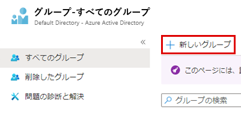
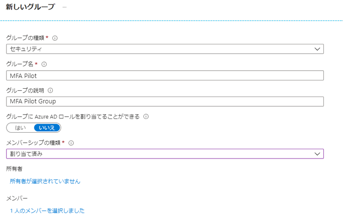

# モジュール 3 - ラボ 1 - 演習 2 -  MFA 条件付きアクセス (Azure Multi-Factor Authentication Pilot のロールアウトを完了する)

この演習では、Azure portal にログインするときに、Azure Multi-Factor Authentication (Azure MFA) を有効にする条件付きアクセスポリシーを構成します。このポリシーは、パイロット ユーザーの特定のグループにデプロイされ、テストされます。条件付きアクセスを使用する Azure MFA のデプロイは、組織および管理者にとって、従来の強制方法よりも大幅に高い柔軟性を持つ方法です。

- Azure Multi-Factor Authentication を有効にする
- Azure Multi-Factor Authentication をテストする

### タスク 1: Azure Multi-Factor Authentication の有効化

1.  グローバル管理者の Holly Dickson としてログインしている Azure portal に戻ります。

1.  ハブで 「**Azure Active Directory**」 に移動します、

1.  「**グループ**」 をクリックして 「**+ 新規グループ**」 をクリックします。

     

1.  次の情報を入力して 「**次へ**」 を選択します。

      * グループの種類: `Security`
      * グループ名: `MFA Pilot`
      * グループの説明: `MFA Pilot Group`
      * メンバーシップ タイプ: `Assigned`
      * メンバー: Select `Lynne Robbins`
  
  
      
  
2.  **Azure Active Directory** を参照し、「**セキュリティ**」 をクリックし、「**ポリシー**」 ブレードで 「**条件付きアクセス**」 を選択します。

3.  「**+ 新しいポリシー**」 を選択します

4.  ポリシーに `MFA Pilot` という名前を付けます
5.  「**ユーザーとグループ**」 の下で、「**0 件のユーザーとグループが選択されました**」 を選択します。「**ユーザーとグループの選択**」 ラジオ　ボタンを選択し、「**ユーザーとグループの選択**」 チェック ボックスをオンにします。
    * パイロットグループ `MFA Pilot` を選択します
    * 「**選択**」 をクリックします

6.  「**クラウドアプリまたは操作**」 で 「**アプリを選択**」 ラジオ ボタンを選択します。
    * 「**選択**」 をクリックします。Azure portal のクラウド アプリは `Microsoft Azure Management` なので、これを選択します。
    * 「**選択**」 をクリックします

7.  「**条件**」 セクションはスキップします
8.  「**許可**」 で 「**アクセス権の付与**」 ラジオ ボタンが選択されていることを確認します
    * 「**多要素認証を要求する**」 ボックスをチェックします
    * 「**選択**」 をクリックします

9.  「**セッション**」 セクションはスキップします
10. 「**ポリシーを有効にする**」 を 「**オン**」 に設定します
11. 「**作成**」 をクリックします

    **注**: ポリシーが失敗したら、作業内容を確認してから再び 「**作成**」 をクリックします。 

### タスク 2: Azure Multi-Factor Authentication をテストする

条件付きアクセス ポリシーが機能することを証明するには、MFA を必要としないリソースへのログインをテストし、次に MFA を必要とする Azure portal へのログインをテストします。

2.  InPrivate モードまたはシークレット モードで新しいブラウザー ウィンドウを開き、**`https://portal.azure.com`** を参照します

       * ユーザー Lynne Robbins としてログインします (Lynne のパスワードはおそらくラボのホスティング プロバイダーから提供された MOD 管理者のパスワードと同じです)。登録して Azure Multi-Factor Authentication を使用するよう求められるはずです。
       * ブラウザー ウィンドウを閉じます。

# ラボ終了
