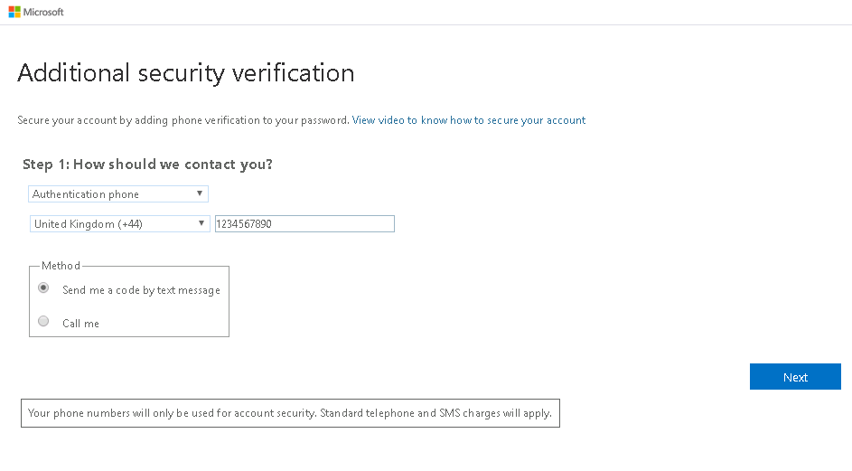

# モジュール 3 - ラボ 2 - 演習 1 - Azure リソースの管理

**シナリオ**

このラボでは、Azure Privileged Identity Management (PIM) を使用してジャスト イン タイム管理を有効にし、特権操作を実行できるユーザー数を制御する方法を学習します。また、使用可能なさまざまなディレクトリ ロールと、PIM がリソース レベルでロールの割り当てに拡張されるなどの新しい機能についても学びます。 

### タスク 1: リソースを検出する

1.  まだ Microsoft 365 管理センターに MOD 管理者としてログインしている場合は、ユーザーを Holly Dickson に切り替えます。**Azure portal** `https://portal.azure.com/` に移動し、グローバル管理者の Holly Dickson としてサインインします。「**すべてのサービス**」 をクリックしてから検索し、`Azure AD Privileged Identity Management` を選択します。

     

1.  同意ページが表示されたら、クリックして PIM に同意します。一部のテナントでは、PIM はすでに有効になっているので、このステップは不要です。

     

1.  「**ID を確認**」 が表示されたらクリックします。

     

1.  「**次へ**」 をクリックします。

     

1.  携帯電話の詳細を入力して、「**次へ**」 をクリックします。

     
 
1.  SMS 経由でコードを受信したら入力して、「**確認**」 をクリックします。

     

1. 検証が成功したら、「**完了**」 をクリックします。

1.  Azure Portal で 「**すべてのサービス**」 をクリックし、「**Azure AD Privileged Identity Management**」 を検索して選択します。

     

1.  同意ページが表示されたら、クリックして PIM に同意します。

     

1.  「**Consent to PIM blade**」 に戻り、「**同意**」 をクリックして 「**はい**」 をクリックします。

     

1.  **F5**を押して Azure portal を更新します。
   
    **注**: ブラウザでポータルを更新しても PIM が有効になっていると表示されない場合は、ログアウトしてから Azure Portal に戻ってください。

# 演習 2 に進んでください
