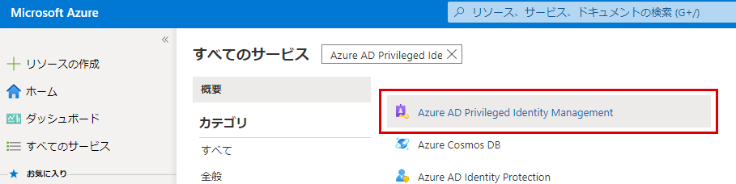

# モジュール 3 - ラボ 2 - 演習 3 - PIM ロールのアクティブ化と非アクティブ化

### タスク 1: ロールをアクティブ化する

Azure AD ディレクトリ ロールが必要な場合は、PIM の 「**自分のロール**」 ナビゲーション オプションを使用してアクティブ化を要求できます。

1.  Holly としてサインインしている Azure portal で 「**すべてのサービス**」 をクリックし、`Azure AD Privileged Identity Management` を検索して選択します。

     

1.  「**Azure AD ロール**」 をクリックします。
 
1.  **クイックスタート**をクリックしてから、**適格性を割り当てる**をクリックします。

     

1.  `Billing Administrator` をクリックして、Patti Fernandez を再び**課金管理者**ロールに追加します。

1.  「**In Private**」 閲覧セッションを開き、`https://portal.azure.com` まで移動します。**Patti** の UPN (たとえば、PattiF@YourTenantHere.onmicrosoft.com) と、ラボ ホスティング プロバイダーから提供されたパスワード (ヒント: パスワードは MOD 管理者のパスワードと同じ可能性があります) を使用して Patti としてログインします。  

1.  Azure Portal で、**すべてのサービス**をクリックして、**Azure AD Privileged Identity Management**を検索して選択します。

     

1.  「**Azure AD ロール**」 をクリックします。

1.  **クイックスタート**をクリックして、**ロールをアクティベートする**をクリックします。

1.  課金管理者のロールで、右にスクロールして**アクティベート**をクリックします。

     

1.  「**続行する前に ID を確認してください**」 と表示されたら、これをクリックします。セッションごとに 1 回だけ認証する必要があります。ウィザードを実行して、Patti を認証します。
 
1.  Azure portal に戻ったら、「**すべてのサービス**」 をクリックして、`Azure AD Privileged Identity Management` を検索して選択します。

1.  「**Azure AD ロール**」 を選択してから、クイックスタートブレードで 「**Activate your role**」 をクリックします。

1.  課金管理者のロールで、右にスクロールして 「**アクティブにする**」 をクリックします。

     

1.  アクティベーションの理由を入力して、「**アクティブにする**」 をクリックします

     

既定により、設定で明示的に構成されていない限り、ロールは承認を必要としません。 

 承認が必要ないロールは、アクティブ化され、アクティブなロールの一覧に追加されます。すぐにロールを使用する場合は、次のセクションの手順に従ってください。

 ロールのアクティベートに承認が必要な場合、ブラウザーの右上隅に、要求が承認待ちであることを知らせる通知が表示されます。

### タスク 2: アクティブ化後すぐにロールを使用する

PIM で役割をアクティブにすると、目的の管理ポータルにアクセスしたり、特定の管理ワークロード内で機能を実行したりするまでに最大 10 分かかる場合があります。アクセス許可の更新を強制するには、次の手順で説明されている 「**アプリケーションへのアクセス**」 ページを使用します。

1.  「**サインアウト**」 をクリックします。

1.  inPrivate 閲覧セッションで Patti としてログインし直します。

### タスク 3: 要求の状態を表示する

保留中のアクティブ化要求の状態を表示することができます。

1.  まだ **Patti** としてサインインしている場合は、Azure portal で 「**すべてのサービス**」 をクリックして、`Azure AD Privileged Identity Management` を検索して選択します。

1.  「**Azure AD ロール**」 をクリックします。

1.  「**保留中の要求**」 をクリックして、要求リストを表示します。

### タスク 4: ロールを非アクティブ化する

ロールは、アクティブになった後、期限 (資格のある期間) に達すると自動的に非アクティブになります。

管理者タスクを早期に終了した場合は、Azure AD Privileged Identity Management でロールを手動で非アクティブにすることもできます。

1.  まだ **Patti** としてサインインしている状態で、Azure AD Privileged Identity Management を開きます。

1.  「**Azure AD ロール**」 をクリックします。

1.  「**自分のロール**」 をクリックします。

     

1.  「**Active assignments**」 をクリックして、アクティブなロールのリストを表示します。

1.  使用が終了したロールを探し、「**非アクティブ化**」 をクリックします。

     

1.  もう一度 「**非アクティブ化**」 をクリックします。

     

# 演習 4 に進んでください
