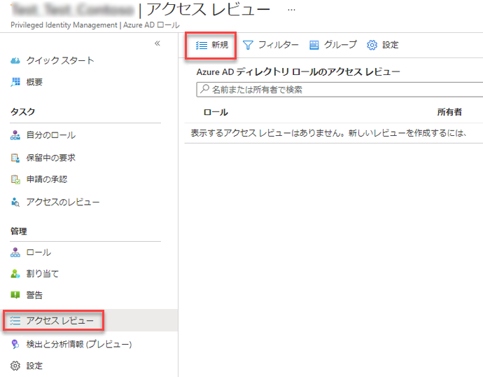
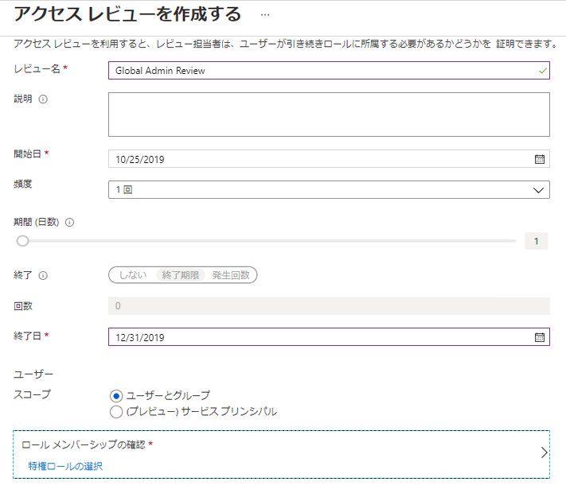
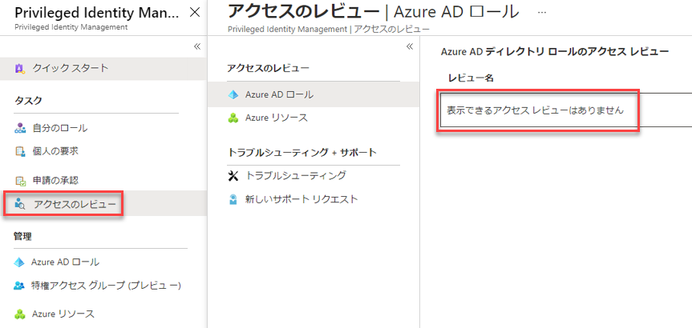

# モジュール 3 - ラボ 2 - 演習 4 - ディレクトリのロール (一般)

### タスク 1: PIM で Azure AD ディレクトリ ロールのアクセス レビューを開始する

ユーザーが持っているアクセス特権がユーザーには不要になった場合、そのロールの割り当ては "古く" なっています。このような古くなったロールの割り当てに関連するリスクを軽減するには、特権ロール管理者またはグローバル管理者が定期的にアクセス レビューを作成して、ユーザーに付与されたロールの確認を管理者に依頼する必要があります。このタスクでは、Azure AD Privileged Identity Management (PIM) でアクセスレビューを開始する手順について説明します。

1.  グローバル管理者アカウントの Holly Dickson としてログインしているブラウザーに戻ります。

1.  PIM アプリケーションのメインページから 「**管理**」 セクションで 「**Azure AD のロール**」 をクリックし、「**アクセス レビュー**」 をクリックして 「**新規**」 をクリックします。

     

1.  次の詳細を入力して、「**開始**」 をクリックします。

      - レビュー名:  `Global Admin Review`
      - 開始日:  `Enter Today's Date` 
      - 頻度: `Drop down to One time`
      - 終了日:  `Enter End of next month`
      - ロール メンバーシップのレビュー:  `Global Administrator`
      - レビュー担当者:  `Holly Dickson`
 
 
     
 
1.  レビューが完了してステータスが 「アクティブ」 になったら、「**グローバル管理者レビュー**」 をクリックします。場合によっては、Azure でビューを更新する必要があります。

1.  「**結果**」 を選択し、「**未レビュー**」 の結果を確認します。

     

### タスク 2: アクセスの承認または拒否

アクセスを承認または拒否する場合は、このロールを引き続き使用するかどうかをレビュー担当者に伝えるだけで済みます。ロールにとどまる場合は 「承認」 を選択し、アクセスが不要な場合は 「拒否」 を選択します。レビュー担当者が結果を適用するまで、状態はすぐに変更されません。アクセス レビューを検索して完了するには、次の手順に従います。

1.  PIM アプリケーションで、「**アクセスをレビュー**」 を選択します。 

2.  「**グローバル管理者レビュー**」 を選択します。

     

3.  レビューを作成した場合を除き、レビューで唯一のユーザーとして表示されます。Holly Dickson の隣にあるチェックボックスを選択し、「**表示**」 をクリックします。

     

5.  「**Azure AD ロールのレビュー**」 ブレードを閉じます。

### タスク 3: PIM で Azure AD ディレクトリ ロールのアクセス レビューを完了する

アクセス レビューが開始されると、特権ロール管理者は特権アクセスの状況を確認できるようになります。ユーザーにアクセスを確認するよう求める電子メールは Azure AD Privileged Identity Management (PIM) によって自動的に送信されます。電子メールが届かなかったユーザーがいる場合は、アクセス レビューを実行する方法に関する手順を送信できます。

アクセス レビューの期間が終わった後、またはすべてのユーザーが自己レビューを完了した後に、このタスクの手順に従って、レビューを管理し、結果を表示することができます。

1. **Azure portal** ポータルに移動して、`Azure AD Privileged Identity Management` を選択します。

1. 「**Azure AD ロール**」 を選択します。

2. **アクセスレビュー**を選択します。

3. グローバル管理者レビューを選択します。 

4. レビューの完了で利用できるオプションの一つを選びます。
     - **停止**  -  すべてのアクセス レビューには終了日が設定されていますが、「停止」 ボタンを使用するとレビューを早期に終了できます。この時点までにレビューを行っていないユーザーは、レビューが停止されるとレビューを実行できなくなります。レビューを停止後に再開することはできません。
     - **適用**  -  終了日に達するか手動で停止されたためにアクセス レビューが完了した後、「適用」 ボタンをクリックすると、レビューの結果が適用されます。レビューでユーザーのアクセスが拒否された場合は、この手順によりそのユーザーのロール割り当てが削除されます。
     - **削除**  -  レビューが今後必要なければ、削除します。「削除」 ボタンを使うと、Privileged Identity Management サービスからレビューが削除されます。

### タスク 4: PIM で Azure AD ディレクトリ ロールのセキュリティ アラートを構成する

環境およびセキュリティ上の目標に合わせて、PIM のセキュリティ アラートの一部をカスタマイズすることができます。以下の手順に従ってセキュリティ アラートの設定を開きます。

1.  `Azure AD Privileged Identity Management` を開きます。

1.  「**Azure AD ロール**」 をクリックします。

1.  「**アラート**」 をクリックしてから 「**設定**」 をクリックします。

1.  そのアラートの設定を構成するアラート名をクリックします。

# 演習 5 に進んでください
