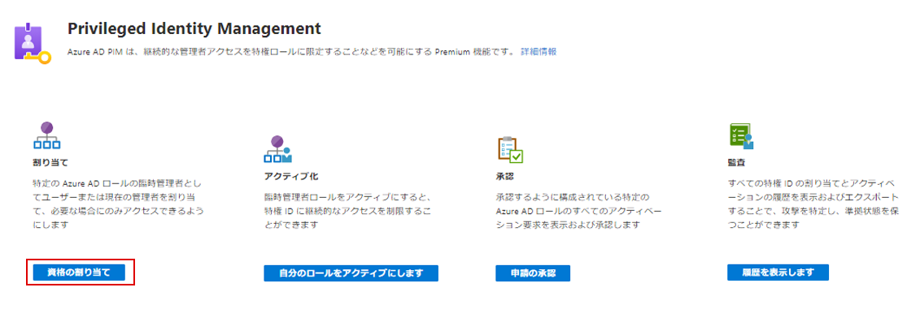
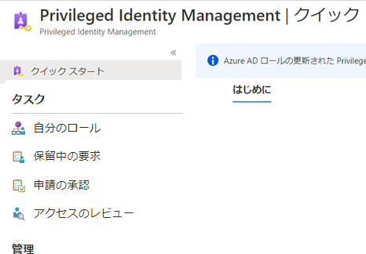
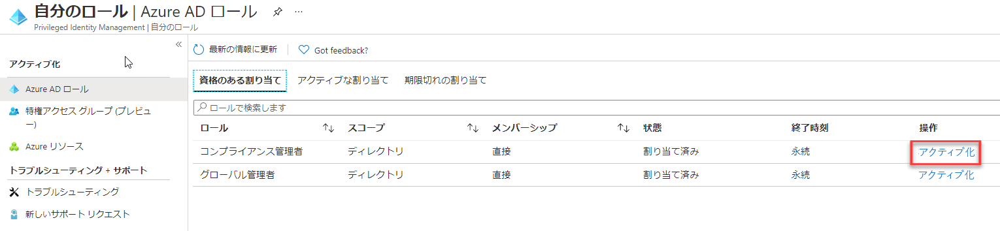
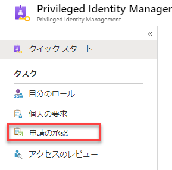
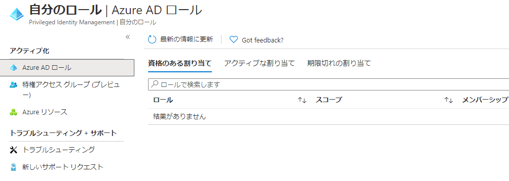

# モジュール 3 - ラボ 2 - 演習 5 - PIM リソースのワークフロー

### タスク 1:  承認が必要になるようにグローバル管理者ロールを構成します。

1.  まだ以前の演習のまま、Holly としてログインしているはずです。  `Azure AD Privileged Identity Management` を開きます。

1.  「**Azure AD ロール**」 をクリックします。

1.  「**設定**」 をクリックします。 

1.  `Global Administrator` を選択します。

1.  「**編集**」 をクリックし、スクロールダウンして 「**アクティブ化には承認が必要です**」 をマークします。  

2.  「**承認者の選択**」 をクリックして Holly Dickson を承認者に指名し、「**選択**」 をクリックします。  「**更新**」 をクリックします。

### タスク 2: グローバル管理者特権で Patti を有効にする

1.  **Azure AD Privileged Identity Management** を開きます。

1.  「**Azure AD ロール**」 をクリックします。

1.  「**クイックスタート**」 をクリックして、「**Assign eligibility**」 を選択します。

     

1.  「**グローバル管理者**」 を選択します。

1.  「**+ 割り当ての追加**」 を選択してから 「**Patti Fernandez**」 を追加します。「**選択**」 をクリックします。

2.  「**次へ**」 をクリックしてから 「**割り当て**」 をクリックします。

1.  inPrivate 閲覧セッションを開き、Patti Fernandez として `https://portal.azure.com` にログインします。  このブラウザーは前の演習から開いたままになっているかもしれません。

1.  **Azure AD Privileged Identity Management** を開きます。

1.  「**自分のロール**」 を選択します。

     

1.  グローバル管理者のロールを**アクティブ化**します。

     

1.  必要に応じてウィザードを使い、Patti の ID を確認します。

1.  **Azure AD Privileged Identity Management** で 「**自分のロール**」 に戻ります。

1.  グローバル管理者のロールの近くで 「**アクティブ化**」 をクリックします。

1.  アクティブ化の理由として「**いくつかの管理タスクを実行する必要がある**」と入力し、「**アクティブ化**」 をクリックします。

要求が「承認保留中」という通知が表示されます。

### タスク 3: PIM で Azure リソース ロールに対する要求を承認または拒否する

Azure AD Privileged Identity Management (PIM) を使用して、アクティブ化の承認を必要とするようにロールを構成できます。また、代理承認者として 1 名以上のユーザーまたはグループを選択できます。Azure リソース ロールの要求を承認または拒否するには、この記事の手順に従ってください。

###### 保留中の要求を表示する

委任された承認者として、Azure リソースロールリクエストが承認を保留しているときに電子メール通知を受け取ります。これらの保留中の要求は、PIM で表示できます。

1.  グローバル管理者アカウントの Holly Dickson を使ってサインインしているブラウザーに切り替えます。

1.  **Azure AD Privileged Identity Management** を開きます。

1.  「**申請の承認**」 をクリックします。

     

1.  Patti からの要求をクリックして、「**承認**」をクリックします。

1.  理由として「**このタスクで許可されている**」と入力し、「**確認**」 をクリックします。

1.  Patti が承認されると、通知が表示されます。

1.  Patti がサインインしている inPrivate 閲覧セッションに戻り、「**自分のロール**」 をクリックして、「**Active assignments**」 を選択します。これでグローバル管理者のステータスが有効になります。

     

# 演習 6 に進んでください
