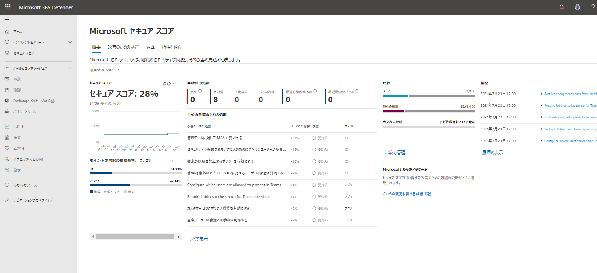

# モジュール 4: ラボ 1 - 演習 1 - Microsoft 365 Security Center でセキュリティ スコアを改善する

あなたはグローバル管理者の Holly Dickson で、Microsoft 365 にサインインしています。

セキュリティ上の利点を提供するサービスは多々あるため、Holly は頻繁に組織のデプロイを保護するために最初に取るべきステップを判断しかねています。Microsoft セキュア スコアは、セキュリティに関する Holly の推奨事項をレビューして優先順位を付けるので、どれを優先すればよいのか把握できます。この演習では、Holly は組織の Microsoft セキュア スコアを確認し、ポータルを使用して推奨されたアクションを実行し、スコアを向上させます。

**スコアの計算のセキュリティ保護**

Security Center では、セキュリティ アナリストの作業を模倣して、セキュリティに関する推奨事項を調査し、各推奨事項の重要度を判断する高度なアルゴリズムを適用します。

Microsoft セキュリティ センターでは、アクティブな推奨事項を絶えず確認し、それらに基づいてセキュリティ スコアを計算します。推奨事項のスコアは、その重大度と、ワークロードのセキュリティに最も影響するセキュリティのベスト プラクティスから導出されます。

### タスク 1: Microsoft 365 セキュリティ ポータルでセキュア スコアを表示します。

1.  管理者として **LON-CL1** 仮想マシンにログインします。パスワードは`Pa55w.rd`です。  Microsoft 365 セキュリティのダッシュボード `https://security.microsoft.com` に移動し、Holly のグローバル管理者の資格情報を使用してログインし、ダッシュボードで 「**Microsoft セキュア スコア**」 を選択します。

2.  上部で、セキュリティ スコアのハイライトを確認できます。

       - **セキュア スコア**は、選択されたサブスクリプションごとの各ポリシーのスコアを表します
       - カテゴリ別のセキュア スコアは、最も注意が必要なリソースはどれかを示します。
 
       

    
      **注**: 各サブスクリプションのセキュリティ スコアの合計は、総合セキュリティ スコアと一致しません。セキュリティ スコアは正常なリソースとリソースの合計間の比率に基づく計算値であり、サブスクリプションのセキュリティ スコアの合計ではありません。 

3.  「**改善のための処置**」 を選択し、そのサブスクリプションでセキュア スコアを改善するために実行できる処置を確認します。

4.  処置の一覧では、各処置に 「**獲得したポイント**」 を表す列があることがわかります。この数字は、処置を実行すれば獲得できるポイント数を示します。たとえば、以下の画面では 「**管理ロールに対して MFA を要求する**」と、最高 10 ポイントを獲得できます。

### タスク 2: Microsoft セキュア スコア履歴を表示します。

「**履歴**」 オプションをクリックすると、セキュア スコアの履歴を表示できます。  

表示する日付範囲をカスタマイズして、特定のセキュア スコア カテゴリに焦点を当てられます。  これにより、時間の経過に伴ってセキュリティに対する姿勢が変化することがわかります。

セキュア スコアの履歴には、実行した具体的なアクションと、スコアへの影響も表示されます。

### タスク 3: セキュア スコアを向上させます。

1.  「**改善のための処置**」 タブをクリックし、「**セルフサービスによるパスワードのリセットを有効にする**」 を選択します。このセキュリティ処置に関する詳細な情報が表示されます。この処置を実行するための具体的な手順が含まれています。

2.  「**管理**」 ボタンをクリックします。  Azure portal の 「**パスワードのリセット - プロパティ**」 ブレードで新しいブラウザーのタブが開きます。
  
3.  「**セルフ サービスによるパスワードのリセットが有効**」 で 「すべて」 をクリックします。 

4.  前のタブで 「すべて」 に設定されていなければ、「**保存**」 をクリックします。

5.  「管理」 エリアで 「**登録**」 をクリックします。

6.  「サインイン時にユーザーに登録を求めますか?」 が 「**はい**」 になっていることを確認します。
 
7.  ユーザーが認証情報を再確認するように求められるまでの日数を `90` 日に変更します。

8.  「**保存**」 をクリックします。

9.  Microsoft セキュア スコアのブラウザー タブに戻ります。

10. 「メモ」 の 「セルフサービスによるパスワードのリセットを有効にする」 ペインに「**<今日の日付>にユーザー全員のセルフ サービスによるパスワードのリセットを有効にした**」と入力し、「**保存して閉じる**」 をクリックします。

**注:**  スコアの更新が Microsoft セキュア スコアに表示されるまでに 24 時間かかる可能性があります。  また、処置に応じて部分的なスコアが表示されることもあります。  たとえば、このテナントにライセンスのあるユーザーが 10 人含まれており、そのうち 2 人しかセルフサービスによるパスワードのリセットが有効になっていない場合は、この処置に対して 1/5 ポイントが与えられます。

スコアの変更を表示するには、24 時間後に Microsoft セキュア スコアに戻り、「履歴」 タブに再びアクセスしてください。

**結果**：このラボでは、Microsoft セキュリティ センターでセキュア スコアを改善する方法を学びました。

# ラボ終了 
