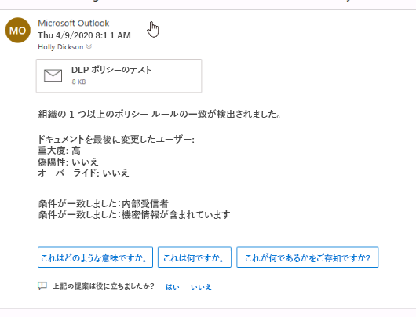

# モジュール 11 - ラボ 1 - 演習 2 - DLP ポリシーをテストする

パイロット プロジェクトでポリシーをテストするところまで到達しました。機密情報が含まれているメールに関する DLP ポリシーをテストすることにします。 

### タスク 1 – 機密情報の含まれたメールに関して DLP ポリシーをテストする

前の演習では、Adatum テナントで米国の社会保障番号に関連した機密情報をメールで検索するカスタム DLP ポリシーを作成しました。この演習では、社会保障番号の含まれたメールを Holly Dickson から Alex Wilber に送信します。

1. クライアント 1 VM (**LON-CL1**) に切り替えます。まだ、Microsoft 365 に Holly Dickson (**holly@M365xZZZZZZ.onmicrosoft.com)** としてログインしているはずです (パスワードは `Pa55w.rd`)。 

2. 米国社会保障番号が含まれているメールを Holly から Alex に送ります。**Microsoft Edge** の 「**Outlook on the web**」 タブで、まだ Holly のページが開いているはずです。「**Outlook on the web**」 タブを選択します。  `https://portal.office.com` のブラウザーが開いていない場合は、必ず Holly Dickson としてサインインし、「**Outlook**」 を選択します。

3. 画面の左上で　「**新しいメッセージ**」 を選択します。 

4. 画面の右側に表示されるメッセージ ペインで以下の情報を入力します。

	- 宛先: `Alex`と入力し始めると、ドロップダウン メニューに「Alex」で始まる名前のユーザーが表示されます。「**Alex Wilber**」 を選択します。

	- 件名を追加: `DLP Policy Test`

	- メッセージ領域: `This customer has social security number: 123-45-6789` と入力します。

6. 「**送信**」 を選択します。

7. これで、複数の社会保障番号が含まれた 2 番目のメッセージが Holly から Alex に送信されます。  画面左上の 「**Outlook**」 で 「**新しいメッセージ**」 を選択します。 

8. 画面の右側に表示されるメッセージ ペインで以下の情報を入力します。

	- 宛先: `Alex`と入力し始めると、ドロップダウン メニューに「Alex」で始まる名前のユーザーが表示されます。「**Alex Wilber**」 を選択します。

	- 件名を追加: `multiple SSN test`

	- メッセージ領域: `SSN = 123 45 6789 and another customer SSN 111 11 1111 and a third 222 22 2222`

11. 「**送信**」 を選択します。

12. クライアント 2 VM (**LON-CL2**) に切り替えます。 

13. VM にサインインする必要がある場合は、既定で**管理者**アカウントが表示されます。「**パスワード**」 フィールドに `Pa55w.rd` と入力します。 

14. クライアント 2 VM (**LON-CL2**) に切り替えます。

15. **Edge** ブラウザーで、まだサインインしているセッションがある場合は、現在のユーザー アカウントからサインアウトして **Edge** のブラウザー タブをすべて閉じます。

16. **Edge** ブラウザーを開き、ウィンドウを最大化してアドレスバーに以下の URL を入力します: `https://outlook.office365.com`

17. **Outlook on the web** に **Alex Wilber** としてサインインします。「**アカウントの選択**」 ウィンドウが表示されても、Alex のアカウントは表示されません。まだサインインしていないためです。「**別のアカウントを使用する**」 を選択します。 

18. 「**サインイン**」 ウィンドウに **AlexW@M365xZZZZZZ.onmicrosoft.com** (ZZZZZZ はラボ ホスティング プロバイダーから提供された一意のテナント ID) と入力して 「**次へ**」 を入力します。

19. 「**パスワードの入力**」 ウィンドウで Alex のパスワード (ヒント: おそらく MOD 管理者のパスワードと同じです) を入力し、「**サインイン**」 を選択します。

20. 「**サインインの状態を維持しますか?**」 ウィンドウで 「**今後、このメッセージを表示しない**」 チェックボックスを選択し、「**はい**」 を選択します。

21. 初めてサイトにアクセスする場合は、言語とタイム ゾーンを設定するよう指示される可能性があります。

	- 「**言語**」 ドロップダウンで 「**日本語**」 を選択します。

	- 「**タイム ゾーン**」 ドロップダウンで希望するタイム ゾーンを選択します。

22. 「**保存**」 を選択します。

23. 新しい Outlook を試してみたいかたずねるウィンドウが表示されたら、「**新しい Outlook を試してみる**」 を選択します。

24. 「**ようこそ**」 ウィンドウが表示されたら、閉じます。

25. **Outlook on the web** の Alex の**受信トレイ**に、Holly が Alex に送ったばかりの、社会保障番号を 1 つ含むメールが表示されるはずです。

26. 複数の社会保障番号が含まれているメールはブロックされており、以下のような警告メッセージが Holly の受信トレイ (LON-CL1) に表示されるはずです。

     

27. この演習の最後の操作として Alex の受信トレイから、このメッセージを削除します。これでカスタム DLP ポリシーのテストに成功しました。

28. 次のラボのためにクライアント VM は両方とも開いたままにします。ブラウザーのタブはどれも閉じないでください。

**このラボのトラブルシューティング**

何も起きず、メールが両方とも Alex に送信された場合:
  
1. DLP ポリシーがテナントに伝達するまでに時間がかかる可能性があります。  ポリシーとその後のスキャンがテナントに届く前にメールが送られた可能性があります。  この場合は、後ほど、このラボに戻り、メールを再び送信してください。

2. もうひとつの可能性は、社会保障番号が適切にメールの本文で書式化されていないことです。  DLP ポリシーの機密情報の取水は、特定の方法 (そのデータの種類で最も一般的なもの) で書式化されたデータをスキャンします。  以下のリンクをクリックすると、DLP ポリシーのスキャンで検出されるようにコンテンツで社会保障番号を書式化する正確な方法が表示されます。
[https://docs.microsoft.com/ja-jp/microsoft-365/compliance/what-the-sensitive-information-types-look-for?view=o365-worldwide#us-social-security-number-ssn](https://docs.microsoft.com/ja-jp/microsoft-365/compliance/what-the-sensitive-information-types-look-for?view=o365-worldwide#us-social-security-number-ssn)

3. DLP ポリシーの構成を確認します。前の演習で説明されているようにポリシーが構成されていることを確認します。

このラボは、さまざまな DLP ポリシーの構成をテストするよい機会となります。このラボを完了したら、他の結果をトリガーするようにこの DLP ポリシーを再構成してみてください。

# ラボ終了
